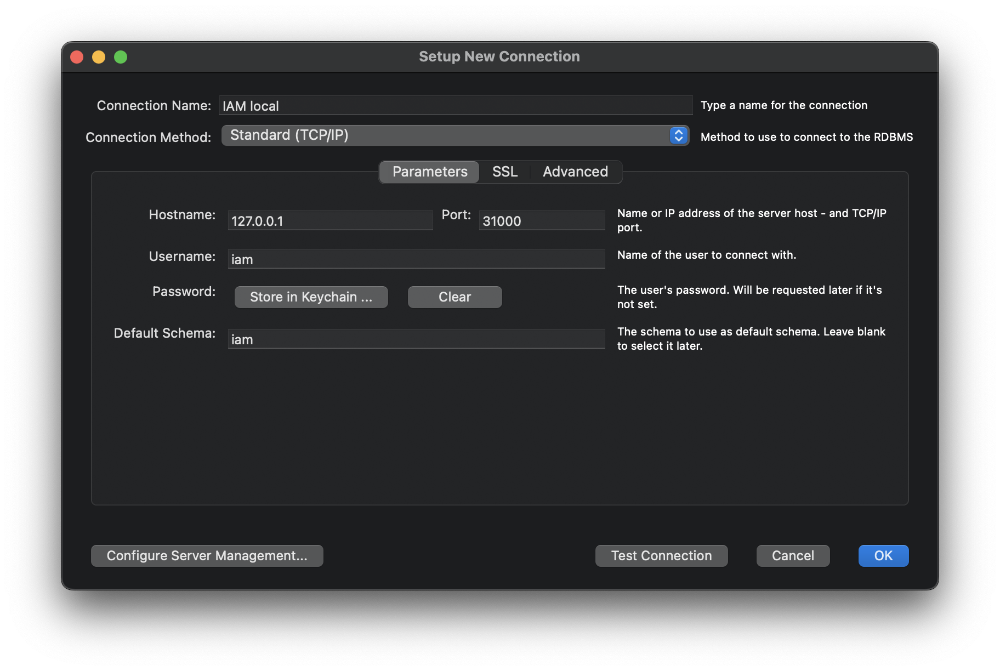

本プロジェクトの開発チームに参加した方向けのスタートガイドです。

## 開発で利用するソフトウェア

- [Docker Desktop](https://www.docker.com/products/docker-desktop)
  - ローカルで DB を構築する際などに利用します
  - `docker-compose`は Docker のサブコマンドとして統合されたのでインストール不要
- [MySQL Workbench](https://www.mysql.com/jp/products/workbench/)
  - SQL クライアント機能や DB モデリング機能を提供します
- [IntelliJ IDEA](https://www.jetbrains.com/ja-jp/idea/)
  - JVM 系言語で実装されているプロダクトの IDE として利用します
  - 別の IDE やエディタを利用していただいても結構ですが、ここでは IntelliJ IDEA を使う前提で解説しています

!!! 詳細は各プロダクトの技術スタックを確認してください

## ローカルでアプリケーションを起動する

Membership Console では、Kubernetes を使って全アプリケーションを一括で起動します。

### 1. Kubernetes リソースを作成

```shell
# リポジトリをclone
$ git clone git@github.com:membership-console/infrastructure.git
$ cd infrastructure

# kubectlでリソースを作成
$ kubectl apply -f k8s
```

実行が完了したら [localhost:30000](http://localhost:30000) へアクセスしてみましょう！

ログインページが表示されるはずです。

### 2. IAM データベースにテストデータを入れる

アプリケーションを起動しただけでは初期ユーザが作成されておらず、ログインできません。

MySQL Workbench を起動し、下記のような Connection を作成してください。

この時、Username 及び Password は両方とも`iam`になります。



MySQL に接続し[検証用データの作成](../開発用資料/検証用データの作成.md)を参考にテストユーザを作成すれば、ローカルの開発環境構築は完了です。
