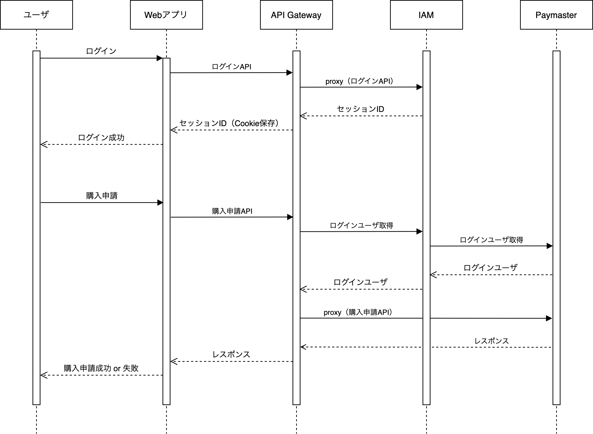

Membership Console のユーザ認証方法を紹介します。

## ユーザ認証の流れ

下図は、ユーザがログイン後に購入申請する流れを示しています。



## IAM

ログインに成功すると、発行したセッション ID を Cookie に保存します。

API Gateway がログインユーザ情報を取得したのちにリバースプロキシする仕組みを後述していますが、IAM は対象外です。
認証フィルタをかけずにリバースプロキシされます。

## API Gateway 経由でログインユーザを取得する

ユーザがログイン済みの場合は、`X-Membership-Console-User`ヘッダに Base64 でエンコードされたログインユーザ情報が付与されます。
API Gateway 経由でログインユーザ情報を付与された状態でリバースプロキシされるので、IAM 以外のプロダクトは IAM にログインユーザを問い合わせる必要がありません。

IAM 以外のプロダクトは、`X-Membership-Console-User`ヘッダにログインユーザが付与される前提で実装してください。
認証必須のリソースが`X-Membership-Console-User`ヘッダが空のリクエストを受信した場合は 401 レスポンスを返却すれば OK です。

```
X-Membership-Console-User: eyJpZCI6IDEsICJmaXJzdE5hbWUiOiAi5aSq6YOOIiwgbGFzdE5hbWU6ICLlsbHnlLAiLCAiZW1haWwiOiAidGFyb195YW1hZGFAZXhhbXBsZS5jb20iLCAiZW50cmFuY2VZZWFyIjogMjAwMCwgInJvbGVzIjogWyJJQU1fQURNSU4iXSwgInVzZXJHcm91cHMiOiBbeyJpZCI6IDEsICJuYW1lIjogIuOCsOODq+ODvOODl0EiLCByb2xlczogWzBdfV19DQo=
```

Base64 でデコードすると、以下のような json 文字列が得られます。

```
{"id": 1, "firstName": "太郎", lastName: "山田", "email": "taro_yamada@example.com", "entranceYear": 2000, "roles": ["IAM_ADMIN"], "userGroups": [{"id": 1, "name": "グループA", roles: [0]}]}
```

| プロパティ名        | 型                 | 概要                 |
| ------------------- | ------------------ | -------------------- |
| id                  | 整数               | ユーザ ID            |
| firstName           | 文字列             | 名                   |
| lastName            | 文字列             | 姓                   |
| email               | 文字列             | メールアドレス       |
| entranceYear        | 整数               | 入学年度             |
| roles               | 文字列リスト       | ロールリスト         |
| userGroups          | オブジェクトリスト | ユーザグループリスト |
| userGroups[*].id    | 整数               | ユーザグループ ID    |
| userGroups[*].name  | 文字列             | ユーザグループ名     |
| userGroups[*].roles | 整数リスト         | ロール ID リスト     |

> ロールの詳細は [RBAC](./RBAC.md) を確認してください
